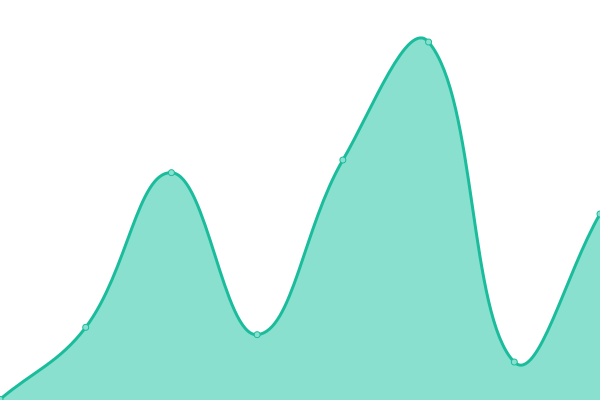
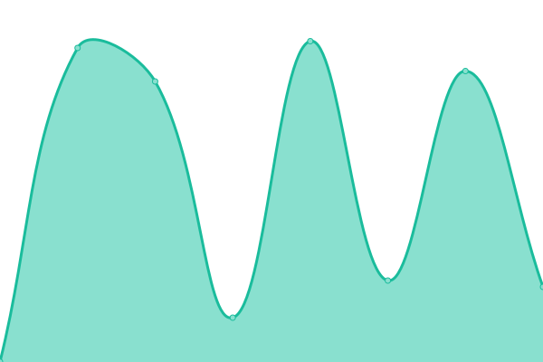

# Status

Built with [**Upptime**](https://upptime.js.org).

This repository contains the open-source uptime monitor and status page for [cc](https://chillcicada.com), powered by [Upptime](https://github.com/upptime/upptime).

With [Upptime](https://upptime.js.org), you can get your own unlimited and free uptime monitor and status page, powered entirely by a GitHub repository. We use [Issues](https://github.com/chillcicada/status/issues) as incident reports, [Actions](https://github.com/chillcicada/status/actions) as uptime monitors, and [Pages](https://status.chillcicada.com) for the status page.

<!--start: status pages-->
<!-- This summary is generated by Upptime (https://github.com/upptime/upptime) -->
<!-- Do not edit this manually, your changes will be overwritten -->
<!-- prettier-ignore -->
| URL | Status | History | Response Time | Uptime |
| --- | ------ | ------- | ------------- | ------ |
|  [Service - Blog](https://chillcicada.com) | 🟩 Up | [service-blog.yml](https://github.com/chillcicada/status/commits/HEAD/history/service-blog.yml) | 

 266ms
     
 | 

<a href="https://status.chillcicada.com/history/service-blog">100.00%</a>
    

|  [Service - Img](https://img.chillcicada.com) | 🟩 Up | [service-img.yml](https://github.com/chillcicada/status/commits/HEAD/history/service-img.yml) | 

 1344ms
     
 | 

<a href="https://status.chillcicada.com/history/service-img">100.00%</a>
    

|  [Service - AI](https://ai.chillcicada.com) | 🟩 Up | [service-ai.yml](https://github.com/chillcicada/status/commits/HEAD/history/service-ai.yml) | 

 2172ms
     
 | 

<a href="https://status.chillcicada.com/history/service-ai">100.00%</a>
    

|  [Service - Panel](https://panel.chillcicada.com) | 🟩 Up | [service-panel.yml](https://github.com/chillcicada/status/commits/HEAD/history/service-panel.yml) | 

 855ms
     
 | 

<a href="https://status.chillcicada.com/history/service-panel">100.00%</a>
    

|  [Service - Zotero WebDAV](https://zotero.chillcicada.com) | 🟩 Up | [service-zotero-web-dav.yml](https://github.com/chillcicada/status/commits/HEAD/history/service-zotero-web-dav.yml) | 

 846ms
     
 | 

<a href="https://status.chillcicada.com/history/service-zotero-web-dav">80.98%</a>
    

|  [Service - My Prs](https://prs.chillcicada.com) | 🟩 Up | [service-my-prs.yml](https://github.com/chillcicada/status/commits/HEAD/history/service-my-prs.yml) | 

 599ms
     
 | 

<a href="https://status.chillcicada.com/history/service-my-prs">100.00%</a>
    

<!--end: status pages-->

[**Visit our status website →**](https://status.chillcicada.com)

## 📄 License

- Powered by: [Upptime](https://github.com/upptime/upptime)
- Code: [MIT](./LICENSE) © [Anand Chowdhary](https://anandchowdhary.com), supported by [Pabio](https://pabio.com)
- Data in the `./history` directory: [Open Database License](https://opendatacommons.org/licenses/odbl/1-0/)
